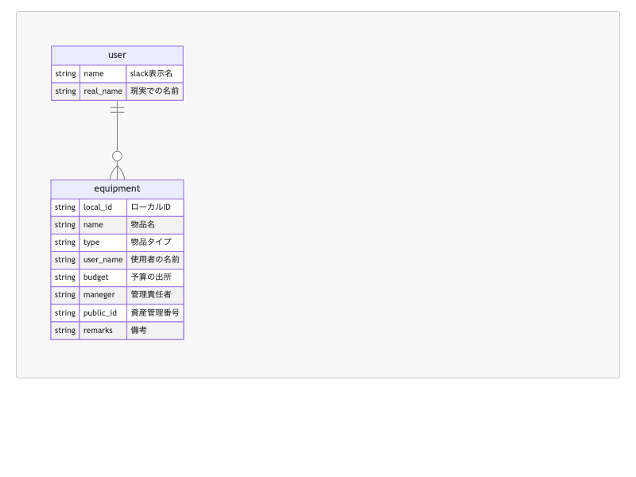

# POSL 物品自動管理ツール

## 開発背景

当研究室では，現在物品係は私含め 2 人いるが，管理が追いついていないのが現状である．物品管理の属人化を解消するため，Slack App による自動物品管理ツールを作成する．

## ER 図

| テーブル名         | 定義                   |
| ------------------ | ---------------------- |
| USERS              | ユーザー情報           |
| EQUIPMENTS         | 物品情報               |
| ASSET_CATEGORIES   | 物品カテゴリ           |
| EQUIPMENTS_HISTORY | 物品の貸し出し等の履歴 |
| BUDGETS            | 予算情報               |
