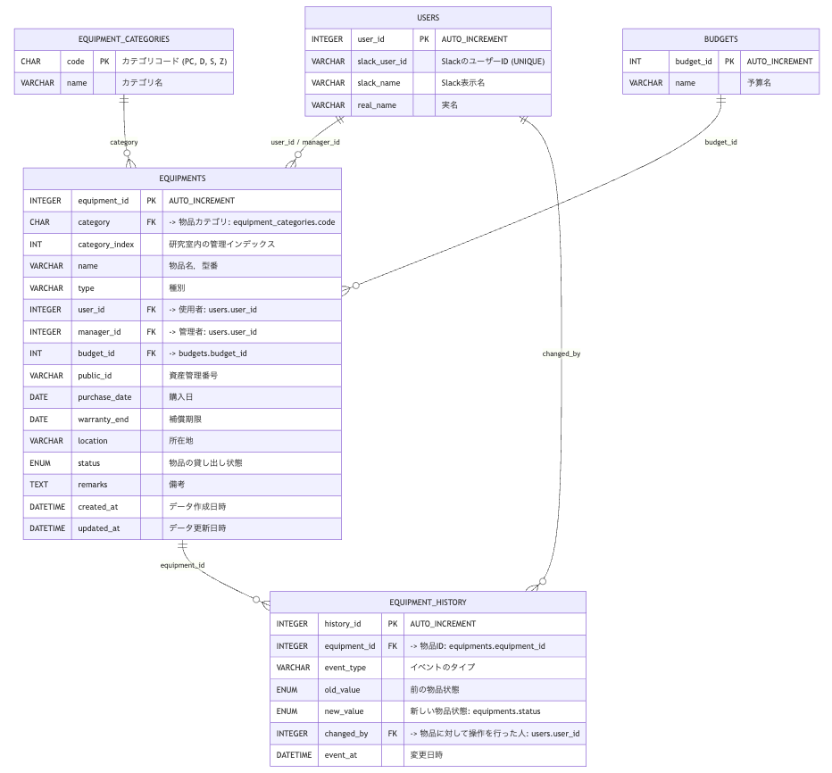

# POSL 物品管理自動化ツール

## 開発背景

現在 POSL では，物品管理係は私含め 2 人いるが，管理が追いついていないのが現状である．物品管理の属人化を解消するため，Slack App による物品管理自動化ツールを作成する．

## 開発ドキュメント

- [ER 図・DB 設計書](./docs/er_diagram.md)
- [アーキテクチャ図(未完)]()
- [アーキテクチャ仕様書](./docs/architecture_document.md)
- [貸出シーケンス](./docs/sequence_diagram_borrow.md)
- [返却シーケンス](./docs/sequence_diagram_return.md)
- [登録シーケンス](./docs/sequence_diagram_regist.md)
- [情報更新シーケンス](./docs/sequence_diagram_update.md)

## 機能要件

- Slack から物品を登録する
- Slack から物品情報を更新する
- Slack から物品を貸し出しする
- Slack から物品を返却する

## 追加要件

- Slack から物品を削除する
- Slack から物品の発注依頼を行う

## データベース設計

### テーブル定義

| テーブル名         | 定義                   |
| ------------------ | ---------------------- |
| USERS              | ユーザー情報           |
| EQUIPMENTS         | 物品情報               |
| ASSET_CATEGORIES   | 物品カテゴリ           |
| EQUIPMENTS_HISTORY | 物品の貸し出し等の履歴 |
| BUDGETS            | 予算情報               |

### ER 図

## 使用技術スタック（予定）

- **バックエンド**: Python 3.12
- **データベース**: SQLite
- **Slack クライアント**: slack-bolt
- **非同期処理**: Celery or RQ（未定）
- **スプレッドシート**: gspread
- **テスト**: pytest
- **リンター**: ruff
- **フォーマッター**: black

## 今後の開発展望

1. 機能要件，データベース設計，シーケンス図の作成
2. API 等の仕様書の作成
3. データベース構築
4. シーケンス図に基づいて実装
   1. CI パイプラインは並行して実装
5. 単体・結合テスト
6. 本番環境への移行（研究室内サーバー）
   1. CD パイプラインも並行して実装
