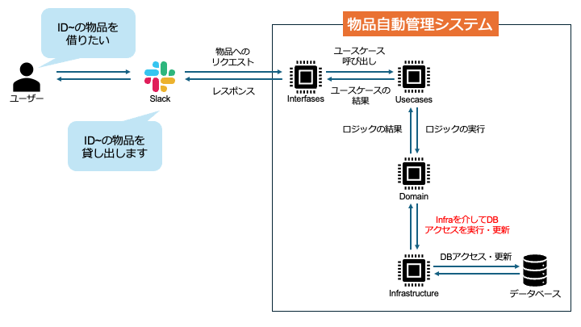

# POSL 物品管理自動化ツール

## 開発背景

現在 POSL では，PC 等の物品管理は私含め 2 人で行なっており，スプレッドシートで直接管理している．しかし，手動管理による弊害として，管理の煩雑さや物品の管理漏れなどが発生してしまっているのが現状である．物品管理の属人化を解消するため，Slack App による物品管理の自動化，および Web 画面による一覧性の向上を目的としたツールを作成する．

## 開発ドキュメント

- [ER 図・DB 設計書](./docs/er_diagram.md)
- [アーキテクチャ仕様書](./docs/architecture_document.md)
- [貸出シーケンス](./docs/sequence_diagram_borrow.md)
- [返却シーケンス](./docs/sequence_diagram_return.md)
- [登録シーケンス](./docs/sequence_diagram_regist.md)
- [情報更新シーケンス](./docs/sequence_diagram_update.md)
- [削除シーケンス](./docs/sequence_diagram_delete.md)

## 機能要件

### Slack アプリ

- **物品登録・更新**: Slack から新規物品の登録や情報の修正を行う
- **貸出・返却処理**: スラッシュコマンドやインタラクティブボタンによる操作
- **物品削除**: 管理者権限による物品データの削除
- **発注依頼**: （追加要件）不足物品の購入申請を Slack 上で完結させる

### Web インターフェース

- **物品一覧閲覧**: リアルタイムな在庫状況（貸出中/保管中）の可視化
- **貸出履歴の確認**: 誰が・いつ・何を借りたかのログを閲覧
- **検索・フィルタリング**: カテゴリ別やステータス別の高度な検索

## アーキテクチャ図

Slack からの操作および Web 画面からの閲覧を，Next.js をベースとしたフルスタック構成で統合管理し，データの永続化には PostgreSQL を使用する．

## データベース設計

### テーブル定義

| テーブル名         | 定義                   |
| ------------------ | ---------------------- |
| USERS              | ユーザー情報           |
| EQUIPMENTS         | 物品情報               |
| ASSET_CATEGORIES   | 物品カテゴリ           |
| EQUIPMENTS_HISTORY | 物品の貸し出し等の履歴 |
| BUDGETS            | 予算情報               |

### ER 図

## 使用技術スタック

TypeScript 一本でフロント・バック・DB 操作を完結させ，型安全性を最大化した構成．

- **フレームワーク**: Next.js (App Router)
- **言語**: TypeScript 5.x
- **データベース**: PostgreSQL
- **ORM**: Prisma
- **Slack クライアント**: @slack/bolt
- **バリデーション**: Zod
- **UI ライブラリ**: Tailwind CSS / shadcn/ui
- **リンター/フォーマッター**: Biome
- **インフラ/実行環境**: Docker

## 今後の開発展望

1. **環境構築・DB 基盤の確立**
   - Docker Compose による PostgreSQL の立ち上げ
   - Prisma スキーマの定義とマイグレーションの実行
2. **Slack アプリ・API 統合**
   - Next.js API Route を用いた Slack Bolt のエンドポイント実装
   - Socket Mode 等による開発環境の疎通確認
3. **ビジネスロジックの実装**
   - シーケンス図に基づいた貸出・返却・履歴保存ロジックの実装
4. **Web インターフェース開発**
   - 物品一覧閲覧画面と検索機能の実装
5. **テスト・品質担保**
   - Vitest によるロジックの単体テスト
   - CI パイプライン（GitHub Actions 等）の構築
6. **本番移行**
   - 研究室内サーバーへの Docker デプロイとバックアップ体制の構築
