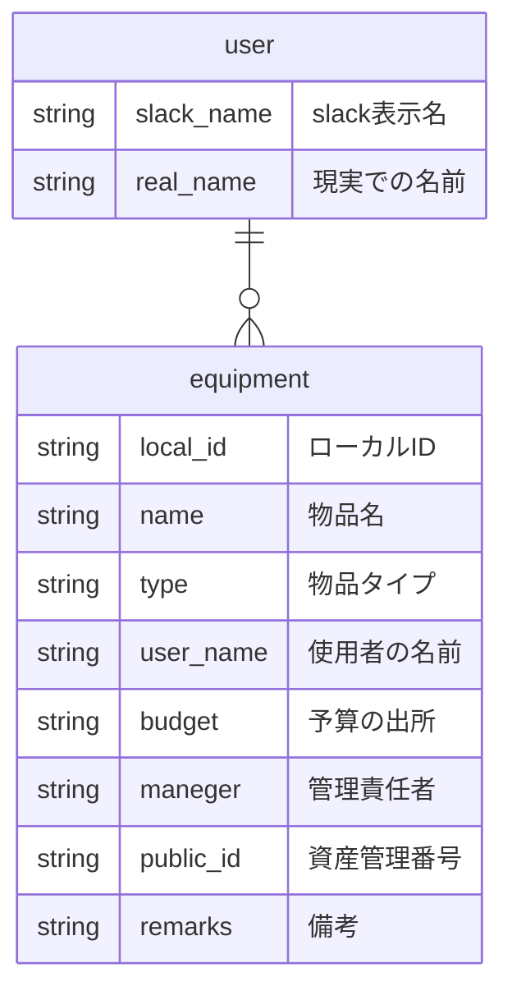

```mermaid
erDiagram
    user ||--o{ equipment : ""

    user {
      string slack_name "slack表示名"
      string real_name "現実での名前"
    }

    equipment {
      string local_id "ローカルID"
      string name "物品名"
      string type "物品タイプ"
      string user_name "使用者の名前"
      string budget "予算の出所"
      string maneger "管理責任者"
      string public_id "資産管理番号"
      string remarks "備考"
    }
```
