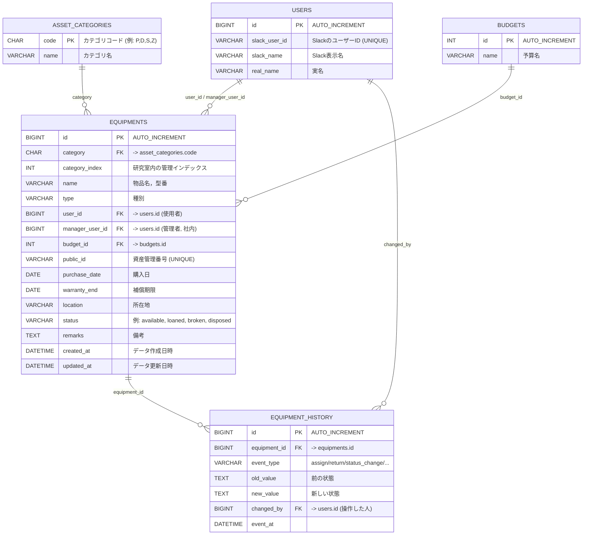

```mermaid
erDiagram
    USERS ||--o{ EQUIPMENTS : "user_id / manager_user_id"
    ASSET_CATEGORIES ||--o{ EQUIPMENTS : "category"
    BUDGETS ||--o{ EQUIPMENTS : "budget_id"
    EQUIPMENTS ||--o{ EQUIPMENT_HISTORY : "equipment_id"
    USERS ||--o{ EQUIPMENT_HISTORY : "changed_by"

    USERS {
      BIGINT id PK "AUTO_INCREMENT"
      VARCHAR slack_user_id "SlackのユーザーID (UNIQUE)"
      VARCHAR slack_name "Slack表示名"
      VARCHAR real_name "実名"
    }

    ASSET_CATEGORIES {
      CHAR code PK "カテゴリコード (例: P,D,S,Z)"
      VARCHAR name "カテゴリ名"
    }

    BUDGETS {
      INT id PK "AUTO_INCREMENT"
      VARCHAR name "予算名"
    }

    EQUIPMENTS {
      BIGINT id PK "AUTO_INCREMENT"
      CHAR category FK "-> asset_categories.code"
      INT category_index "研究室内の管理インデックス"
      VARCHAR name "物品名，型番"
      VARCHAR type "種別"
      BIGINT user_id FK "-> users.id (使用者)"
      BIGINT manager_user_id FK "-> users.id (管理者, 社内)"
      INT budget_id FK "-> budgets.id"
      VARCHAR public_id "資産管理番号 (UNIQUE)"
      DATE purchase_date "購入日"
      DATE warranty_end "補償期限"
      VARCHAR location "所在地"
      VARCHAR status "例: available, loaned, broken, disposed"
      TEXT remarks "備考"
      DATETIME created_at "データ作成日時"
      DATETIME updated_at "データ更新日時"
    }

    EQUIPMENT_HISTORY {
      BIGINT id PK "AUTO_INCREMENT"
      BIGINT equipment_id FK "-> equipments.id"
      VARCHAR event_type "assign/return/status_change/..."
      TEXT old_value "前の状態"
      TEXT new_value "新しい状態"
      BIGINT changed_by FK "-> users.id (操作した人)"
      DATETIME event_at
    }

```
