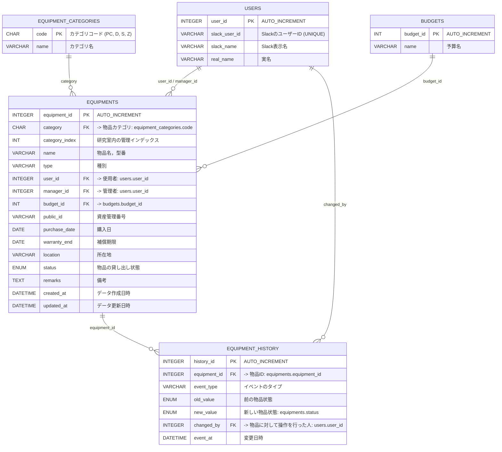

# DB 設計書

- [DB 設計書](#db-設計書)
  - [データベース情報](#データベース情報)
  - [テーブル定義](#テーブル定義)
    - [ユーザー情報テーブル](#ユーザー情報テーブル)
    - [物品カテゴリテーブル](#物品カテゴリテーブル)
    - [予算テーブル](#予算テーブル)
    - [物品テーブル](#物品テーブル)
      - [カラムの取りうる値](#カラムの取りうる値)
    - [物品履歴テーブル](#物品履歴テーブル)
      - [カラムの取りうる値](#カラムの取りうる値-1)
  - [ER 図](#er-図)

## データベース情報

- **DB 論理名**: POSL 物品データベース
- **DB 物理名**: posl.db
- **RDBMS の種類**: SQLite

## テーブル定義

### ユーザー情報テーブル

- **論理名**: ユーザー情報
- **物理名**: USERS

| カラム物理名  | カラム論理名        | データ型 | 凡例        | PK  | FK  | ユニーク制約 | 備考           |
| ------------- | ------------------- | -------- | ----------- | --- | --- | ------------ | -------------- |
| user_id       | ユーザー ID         | INTEGER  | 1           | ○   |     | ○            | AUTO_INCREMENT |
| slack_user_id | Slack のユーザー ID | VARCHAR  | geboi215ngo |     |     | ○            |                |
| slack_name    | Slack の表示名      | VARCHAR  | Yuki Toi    |     |     |              |                |
| real_name     | 実名                | VARCHAR  | 戸井裕規    |     |     |              |                |

### 物品カテゴリテーブル

- **論理名**: 物品カテゴリ
- **物理名**: EQUIPMENT_CATEGORIES

| カラム物理名 | カラム論理名   | データ型 | 凡例     | PK  | FK  | ユニーク制約 | 備考        |
| ------------ | -------------- | -------- | -------- | --- | --- | ------------ | ----------- |
| code         | カテゴリコード | CHAR     | PC       | ○   |     |              | PC, D, S, Z |
| name         | カテゴリ名     | VARCHAR  | パソコン |     |     |              |             |

### 予算テーブル

- **論理名**: 予算
- **物理名**: BUDGETS

| カラム物理名 | カラム論理名 | データ型 | 凡例       | PK  | FK  | ユニーク制約 | 備考           |
| ------------ | ------------ | -------- | ---------- | --- | --- | ------------ | -------------- |
| budget_id    | 予算 ID      | INTEGER  | 1          | ○   |     |              | AUTO_INCREMENT |
| name         | 予算名       | VARCHAR  | 共同研究 A |     |     |              |                |

### 物品テーブル

- **論理名**: 物品
- **物理名**: EQUIPMENTS

| カラム物理名   | カラム論理名       | データ型 | 凡例                | PK  | FK  | ユニーク制約 | 備考                |
| -------------- | ------------------ | -------- | ------------------- | --- | --- | ------------ | ------------------- |
| equipment_id   | 物品 ID            | INTEGER  | 1                   | ○   |     | ○            | AUTO_INCREMENT      |
| category       | カテゴリコード     | CHAR     | PC                  |     | ○   |              |                     |
| category_index | カテゴリ内管理番号 | INTEGER  | 12                  |     |     |              |                     |
| name           | 物品名/型番        | VARCHAR  | MacBook Pro 14      |     |     |              |                     |
| type           | 種別               | VARCHAR  | ノート PC           |     |     |              |                     |
| user_id        | 使用者 ID          | INTEGER  | 2                   |     | ○   |              |                     |
| manager_id     | 管理者 ID          | INTEGER  | 1                   |     | ○   |              |                     |
| budget_id      | 予算 ID            | INTEGER  | 3                   |     | ○   |              |                     |
| public_id      | 資産管理番号       | VARCHAR  | ASSET-2023-001      |     |     | ○            |                     |
| purchase_date  | 購入日             | DATE     | 2023-04-01          |     |     |              |                     |
| warranty_end   | 補償期限           | DATE     | 2026-04-01          |     |     |              |                     |
| location       | 所在地             | VARCHAR  | TTM3 の下           |     |     |              |                     |
| status         | 状態               | ENUM     | available           |     |     |              |                     |
| remarks        | 備考               | TEXT     | 充電器欠品          |     |     |              |                     |
| created_at     | データ作成日時     | DATETIME | 2023-04-02 10:00:00 |     |     |              | yyyy-mm-dd hh:mm:ss |
| updated_at     | データ更新日時     | DATETIME | 2023-05-01 09:00:00 |     |     |              | yyyy-mm-dd hh:mm:ss |

#### カラムの取りうる値

- status
  - available: 未使用
  - borrowed: 使用中
  - broken: 故障 or 廃棄予定
  - disposed: 廃棄
-

### 物品履歴テーブル

- **論理名**: 物品履歴
- **物理名**: EQUIPMENT_HISTORY

| カラム物理名 | カラム論理名      | データ型 | 凡例                | PK  | FK  | ユニーク制約 | 備考                |
| ------------ | ----------------- | -------- | ------------------- | --- | --- | ------------ | ------------------- |
| history_id   | 物品履歴 ID       | INTEGER  | 5001                | ○   |     |              | AUTO_INCREMENT      |
| equipment_id | 物品 ID           | INTEGER  | 3                   |     | ○   |              |                     |
| event_type   | イベント種別      | VARCHAR  | assign              |     |     |              |                     |
| old_value    | 変更前情報        | ENUM     | available"          |     |     |              |                     |
| new_value    | 変更後情報        | ENUM     | borrowed"           |     |     |              |                     |
| changed_by   | 操作者ユーザー ID | INTEGER  | 1                   |     | ○   |              |                     |
| event_at     | 変更日時          | DATETIME | 2023-05-01 10:00:00 |     |     |              | yyyy-mm-dd hh:mm:ss |

#### カラムの取りうる値

- event_type
  - assign: 登録
  - lend: 貸し出し
  - change: 使用者変更
  - return: 返却
  - break: 故障 or 廃棄予定
  - dispose: 廃棄

## ER 図

