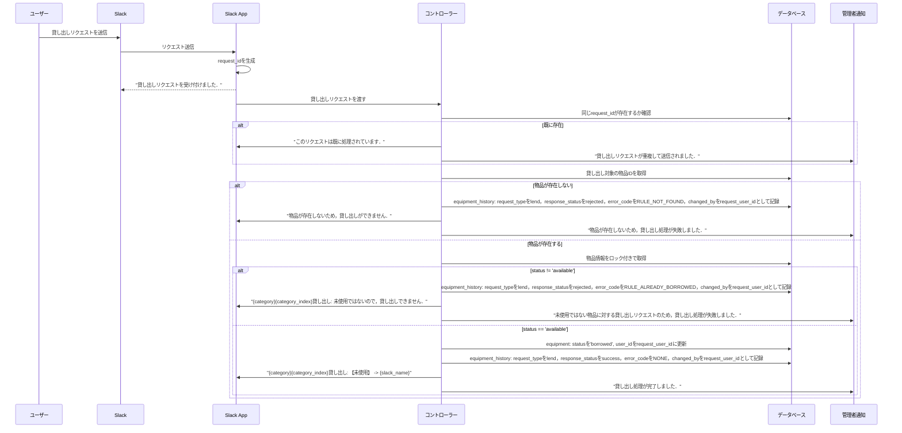

# 物品を借りる機能

- [物品を借りる機能](#物品を借りる機能)
  - [機能詳細](#機能詳細)
  - [シーケンス図](#シーケンス図)

## 機能詳細

Slack から貸し出しメッセージを送信し，物品を借りる．

## シーケンス図

```mermaid
sequenceDiagram
    participant ユーザー
    participant Slack
    participant SlackApp as Slack App
    participant Controller as コントローラー
    participant DB as データベース
    participant Admin as 管理者通知

    %% 1. Slackでリクエスト送信
    ユーザー ->> Slack: 貸し出しリクエストを送信
    Slack ->> SlackApp: リクエスト送信
    SlackApp ->> SlackApp: request_idを生成
    SlackApp -->> Slack: "貸し出しリクエストを受け付けました．"

    %% 2. リクエスト受け取り
    SlackApp ->> Controller: 貸し出しリクエストを渡す
    Controller ->> DB: 同じrequest_idが存在するか確認
    alt 既に存在
        Controller ->> SlackApp: "このリクエストは既に処理されています．"
        Controller ->> Admin: "貸し出しリクエストが重複して送信されました．"
    end

    %% 3. 貸し出し処理を実行
    Controller ->> DB: 貸し出し対象の物品IDを取得
    alt 物品が存在しない
        Controller ->> DB: equipment_history: request_typeをlend，response_statusをrejected，error_codeをRULE_NOT_FOUND，changed_byをrequest_user_idとして記録
        Controller ->> SlackApp: "物品が存在しないため，貸し出しができません．"
        Controller ->> Admin: "物品が存在しないため，貸し出し処理が失敗しました．"
    else 物品が存在する
        %% Controller ->> DB: BEGIN TRANSACTION
        Controller ->> DB: 物品情報をロック付きで取得
        %% DB -->> Controller: 物品情報
        %% Controller ->> DB: 状態を確認
        alt status != 'available'
            Controller ->> DB: equipment_history: request_typeをlend，response_statusをrejected，error_codeをRULE_ALREADY_BORROWED，changed_byをrequest_user_idとして記録
            Controller ->> SlackApp: "{category}{category_index}貸し出し: 未使用ではないので，貸し出しできません．"
            Controller ->> Admin: "未使用ではない物品に対する貸し出しリクエストのため，貸し出し処理が失敗しました．"
        else status == 'available'
            Controller ->> DB: equipment: statusを'borrowed', user_idをrequest_user_idに更新
            Controller ->> DB: equipment_history: request_typeをlend，response_statusをsuccess，error_codeをNONE，changed_byをrequest_user_idとして記録
            Controller ->> SlackApp: "{category}{category_index}貸し出し: 【未使用】 -> {slack_name}"
            Controller ->> Admin: "貸し出し処理が完了しました．"
        end
        %% Controller ->> DB: COMMIT
    end

```
