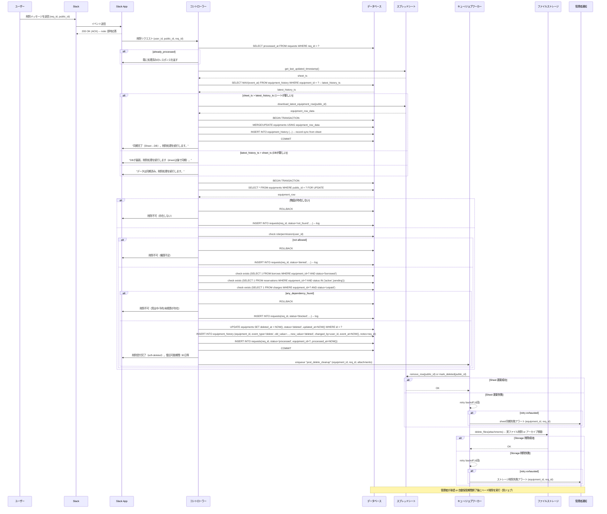

# 物品を削除する機能

- [物品を削除する機能](#物品を削除する機能)
  - [機能詳細](#機能詳細)
  - [シーケンス図](#シーケンス図)

## 機能詳細

Slack から削除メッセージを送信し，物品を削除する

## シーケンス図

```mermaid
sequenceDiagram
    participant ユーザー
    participant Slack
    participant SlackApp as Slack App
    participant Controller as コントローラー
    participant DB as データベース
    participant Sheet as スプレッドシート
    participant Queue as キュー/ジョブワーカー
    participant Storage as ファイルストレージ
    participant Admin as 管理者通知

    %% 1. Slack受信 -> ACK
    ユーザー ->> Slack: 削除メッセージを送信 (req_id, public_id)
    Slack ->> SlackApp: イベント送信
    SlackApp -->> Slack: 200 OK (ACK)  -- note: 即時応答

    %% 2. 冪等性チェック
    SlackApp ->> Controller: 削除リクエスト (user_id, public_id, req_id)
    Controller ->> DB: SELECT processed_at FROM requests WHERE req_id = ?
    alt already_processed
        Controller ->> SlackApp: 既に処理済みのレスポンスを返す
    end

    %% 3. 同期確認: Sheet vs DB
    Controller ->> Sheet: get_last_updated_timestamp()
    Sheet -->> Controller: sheet_ts
    Controller ->> DB: SELECT MAX(event_at) FROM equipment_history WHERE equipment_id = ?  -- latest_history_ts
    DB -->> Controller: latest_history_ts

    alt sheet_ts > latest_history_ts (シートが新しい)
        Controller ->> Sheet: download_latest_equipment_row(public_id)
        Sheet -->> Controller: equipment_row_data
        Controller ->> DB: BEGIN TRANSACTION
        Controller ->> DB: MERGE/UPDATE equipments USING equipment_row_data
        Controller ->> DB: INSERT INTO equipment_history (...) -- record sync from sheet
        Controller ->> DB: COMMIT
        Controller ->> SlackApp: "同期完了（Sheet→DB）。削除処理を続行します。"
    else latest_history_ts > sheet_ts (DBが新しい)
        Controller ->> SlackApp: "DBが最新。削除処理を続行します（sheetは後で同期）。"
    else
        Controller ->> SlackApp: "データは同期済み。削除処理を続行します。"
    end

    %% 4. 削除前検証（排他ロック + 権限・依存チェック）
    Controller ->> DB: BEGIN TRANSACTION
    Controller ->> DB: SELECT * FROM equipments WHERE public_id = ? FOR UPDATE
    DB -->> Controller: equipment_row
    alt 物品が存在しない
        Controller ->> DB: ROLLBACK
        Controller ->> SlackApp: 削除不可（存在しない）
        Controller ->> DB: INSERT INTO requests(req_id, status='not_found', ...)  -- log
    else
        %% 権限チェック
        Controller ->> DB: check role/permission(user_id)
        alt not allowed
            Controller ->> DB: ROLLBACK
            Controller ->> SlackApp: 削除不可（権限不足）
            Controller ->> DB: INSERT INTO requests(req_id, status='denied', ...)  -- log
        else
            %% 依存関係チェック（貸出中 or 予約 or 未精算）
            Controller ->> DB: check exists (SELECT 1 FROM borrows WHERE equipment_id=? AND status='borrowed')
            Controller ->> DB: check exists (SELECT 1 FROM reservations WHERE equipment_id=? AND status IN ('active','pending'))
            Controller ->> DB: check exists (SELECT 1 FROM charges WHERE equipment_id=? AND status='unpaid')
            alt any_dependency_found
                Controller ->> DB: ROLLBACK
                Controller ->> SlackApp: 削除不可（貸出中/予約/未精算が存在）
                Controller ->> DB: INSERT INTO requests(req_id, status='blocked', ...)  -- log
            else
                %% 5. ソフトデリート（安全策）＋履歴記録
                Controller ->> DB: UPDATE equipments SET deleted_at = NOW(), status='deleted', updated_at=NOW() WHERE id = ?
                Controller ->> DB: INSERT INTO equipment_history (equipment_id, event_type='delete', old_value=..., new_value='deleted', changed_by=user_id, event_at=NOW(), notes=req_id)
                Controller ->> DB: INSERT INTO requests(req_id, status='processed', equipment_id=?, processed_at=NOW())
                Controller ->> DB: COMMIT

                Controller ->> SlackApp: 削除受付完了（soft-deleted）。復旧可能期間: 30日等

                %% 6. 非同期クリーンアップ（sheet更新、添付削除、ストレージ削除）
                Controller ->> Queue: enqueue "post_delete_cleanup" (equipment_id, req_id, attachments)
            end
        end
    end

    %% 7. キューワーカー処理: スプレッドシート同期 & ストレージ削除
    Queue ->> Sheet: remove_row(public_id) or mark_deleted(public_id)
    alt Sheet 更新成功
        Sheet -->> Queue: OK
    else Sheet 更新失敗
        Queue -->> Queue: retry backoff (n回)
        alt retry exhausted
            Queue ->> Admin: sheet同期失敗アラート (equipment_id, req_id)
        end
    end

    Queue ->> Storage: delete_files(attachments)  -- 実ファイル削除 or アーカイブ移動
    alt Storage 削除成功
        Storage -->> Queue: OK
    else Storage 削除失敗
        Queue -->> Queue: retry backoff (n回)
        alt retry exhausted
            Queue ->> Admin: ストレージ削除失敗アラート (equipment_id, req_id)
        end
    end

    %% 8. 最終フェーズ（復旧期間終了 → ハード削除 or アーカイブ）
    Note over Admin, DB: 管理者が承認 or 自動保管期間終了後にハード削除を実行（別ジョブ）

```
