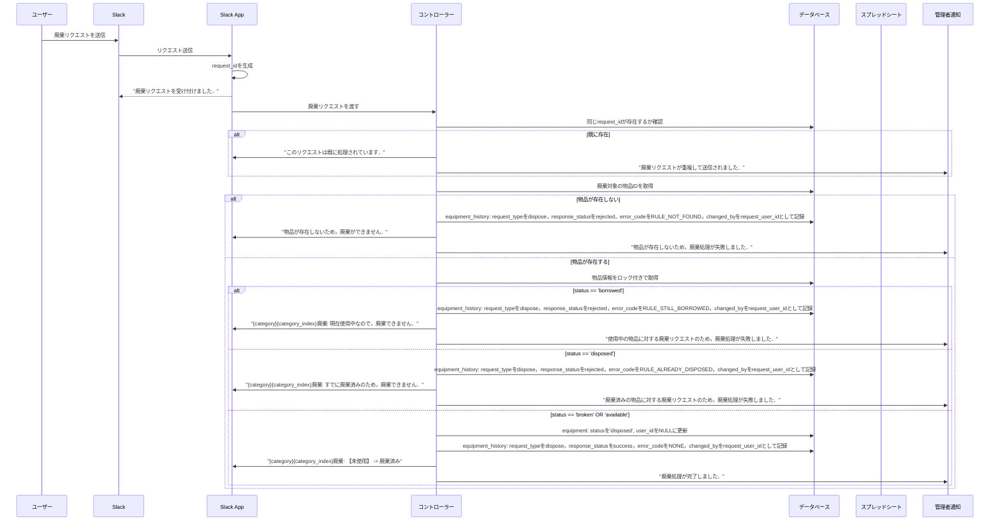

# 物品を廃棄する機能

- [物品を廃棄する機能](#物品を廃棄する機能)
  - [機能詳細](#機能詳細)
  - [シーケンス図](#シーケンス図)

## 機能詳細

Slack から廃棄メッセージを送信し，物品を廃棄する

## シーケンス図

```mermaid
sequenceDiagram
    participant ユーザー
    participant Slack
    participant SlackApp as Slack App
    participant Controller as コントローラー
    participant DB as データベース
    participant Sheet as スプレッドシート
    participant Admin as 管理者通知

    %% 1. Slackでリクエスト送信
    ユーザー ->> Slack: 廃棄リクエストを送信
    Slack ->> SlackApp: リクエスト送信
    SlackApp ->> SlackApp: request_idを生成
    SlackApp -->> Slack: "廃棄リクエストを受け付けました．"

    %% 2. リクエスト受け取り
    SlackApp ->> Controller: 廃棄リクエストを渡す
    Controller ->> DB: 同じrequest_idが存在するか確認
    alt 既に存在
        Controller ->> SlackApp: "このリクエストは既に処理されています．"
        Controller ->> Admin: "廃棄リクエストが重複して送信されました．"
    end

    %% 3. 廃棄処理を実行
    Controller ->> DB: 廃棄対象の物品IDを取得
    alt 物品が存在しない
        Controller ->> DB: equipment_history: request_typeをdispose，response_statusをrejected，error_codeをRULE_NOT_FOUND，changed_byをrequest_user_idとして記録
        Controller ->> SlackApp: "物品が存在しないため，廃棄ができません．"
        Controller ->> Admin: "物品が存在しないため，廃棄処理が失敗しました．"
    else 物品が存在する
        %% Controller ->> DB: BEGIN TRANSACTION
        Controller ->> DB: 物品情報をロック付きで取得
        %% DB -->> Controller: equipment_row
        %% Controller ->> DB: check status
        alt status == 'borrowed'
            Controller ->> DB: equipment_history: request_typeをdispose，response_statusをrejected，error_codeをRULE_STILL_BORROWED，changed_byをrequest_user_idとして記録
            Controller ->> SlackApp: "{category}{category_index}廃棄: 現在使用中なので，廃棄できません．"
            Controller ->> Admin: "使用中の物品に対する廃棄リクエストのため，廃棄処理が失敗しました．"
        %% else status == 'available'
        %%     Controller ->> DB: equipment_history: request_typeをdispose，response_statusをrejected，error_codeをRULE_NOT_BROKEN，changed_byをrequest_user_idとして記録
        %%     Controller ->> SlackApp: "{category}{category_index}廃棄: 廃棄予定ではないので，廃棄できません．"
        %%     Controller ->> Admin: "廃棄予定ではない物品に対する廃棄リクエストのため，廃棄処理が失敗しました．"
        else status == 'disposed'
            Controller ->> DB: equipment_history: request_typeをdispose，response_statusをrejected，error_codeをRULE_ALREADY_DISPOSED，changed_byをrequest_user_idとして記録
            Controller ->> SlackApp: "{category}{category_index}廃棄: すでに廃棄済みのため，廃棄できません．"
            Controller ->> Admin: "廃棄済みの物品に対する廃棄リクエストのため，廃棄処理が失敗しました．"
        else status == 'broken' OR 'available'
            Controller ->> DB: equipment: statusを'disposed', user_idをNULLに更新
            Controller ->> DB: equipment_history: request_typeをdispose，response_statusをsuccess，error_codeをNONE，changed_byをrequest_user_idとして記録
            Controller ->> SlackApp: "{category}{category_index}廃棄: 【未使用】 -> 廃棄済み"
            Controller ->> Admin: "廃棄処理が完了しました．"
        %% Controller ->> DB: COMMIT
        end
    end

```
