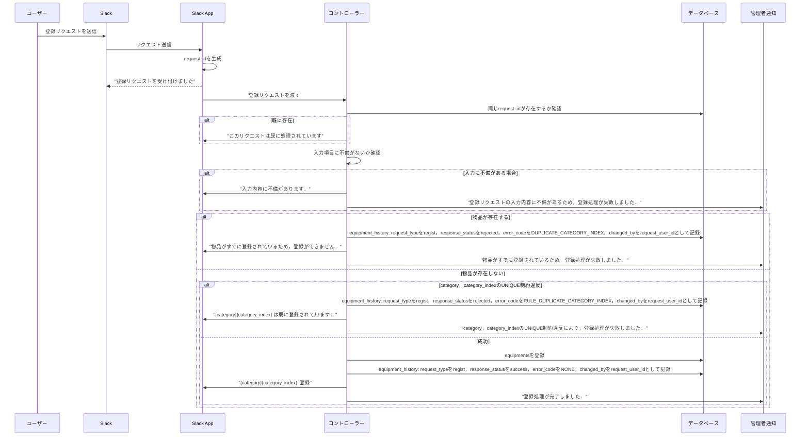

# 物品を登録する機能

- [物品を登録する機能](#物品を登録する機能)
  - [機能詳細](#機能詳細)
  - [シーケンス図](#シーケンス図)

## 機能詳細

Slack から登録メッセージを送信し，物品を登録する．

## シーケンス図

```mermaid
sequenceDiagram
    participant ユーザー
    participant Slack
    participant SlackApp as Slack App
    participant Controller as コントローラー
    participant DB as データベース
    participant Admin as 管理者通知

    %% 1. Slackでリクエスト送信
    ユーザー ->> Slack: 登録リクエストを送信
    Slack ->> SlackApp: リクエスト送信
    SlackApp ->> SlackApp: request_idを生成
    SlackApp -->> Slack: "登録リクエストを受け付けました"

    %% 2. リクエスト受け取り
    SlackApp ->> Controller: 登録リクエストを渡す
    Controller ->> DB: 同じrequest_idが存在するか確認
    alt 既に存在
        Controller ->> SlackApp: "このリクエストは既に処理されています"
    end

    %% 3. 入力バリデーション
    Controller ->> Controller: 入力項目に不備がないか確認
    alt 入力に不備がある場合
        Controller ->> SlackApp: "入力内容に不備があります．"
        Controller ->> Admin: "登録リクエストの入力内容に不備があるため，登録処理が失敗しました．"
    end

    %% 4. 登録処理を実行
    %% Controller ->> DB: BEGIN TRANSACTION
    alt 物品が存在する
        Controller ->> DB: equipment_history: request_typeをregist，response_statusをrejected，error_codeをDUPLICATE_CATEGORY_INDEX，changed_byをrequest_user_idとして記録
        Controller ->> SlackApp: "物品がすでに登録されているため，登録ができません．"
        Controller ->> Admin: "物品がすでに登録されているため，登録処理が失敗しました．"
    else 物品が存在しない
        alt category，category_indexのUNIQUE制約違反
            Controller ->> DB: equipment_history: request_typeをregist，response_statusをrejected，error_codeをRULE_DUPLICATE_CATEGORY_INDEX，changed_byをrequest_user_idとして記録
            Controller ->> SlackApp: "{category}{category_index} は既に登録されています．"
            Controller ->> Admin: "category，category_indexのUNIQUE制約違反により，登録処理が失敗しました．"
        else 成功
            Controller ->> DB: equipmentsを登録
            Controller ->> DB: equipment_history: request_typeをregist，response_statusをsuccess，error_codeをNONE，changed_byをrequest_user_idとして記録
            Controller ->> SlackApp: "{category}{category_index}: 登録"
            Controller ->> Admin: "登録処理が完了しました．"
        end
    end

```
