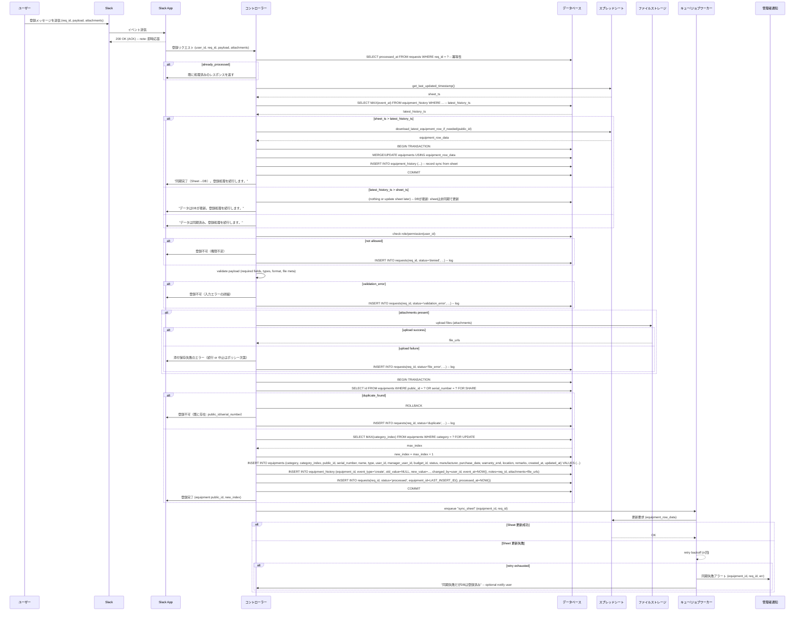

# から物品を登録する機能

- [から物品を登録する機能](#から物品を登録する機能)
  - [機能詳細](#機能詳細)
  - [シーケンス図](#シーケンス図)

## 機能詳細

Slack から登録メッセージを送信し，物品を登録する

## シーケンス図

```mermaid
sequenceDiagram
    participant ユーザー
    participant Slack
    participant SlackApp as Slack App
    participant Controller as コントローラー
    participant DB as データベース
    participant Sheet as スプレッドシート
    participant Storage as ファイルストレージ
    participant Queue as キュー/ジョブワーカー
    participant Admin as 管理者通知

    %% 1. Slack受信 -> ACK
    ユーザー ->> Slack: 登録メッセージを送信 (req_id, payload, attachments)
    Slack ->> SlackApp: イベント送信
    SlackApp -->> Slack: 200 OK (ACK)  -- note: 即時応答

    %% 2. リクエスト受け取り（冪等性チェック）
    SlackApp ->> Controller: 登録リクエスト (user_id, req_id, payload, attachments)
    Controller ->> DB: SELECT processed_at FROM requests WHERE req_id = ?   -- 冪等性
    alt already_processed
        Controller ->> SlackApp: 既に処理済みのレスポンスを返す
    end

    %% 3. 同期確認: Sheet vs DB のタイムスタンプ
    Controller ->> Sheet: get_last_updated_timestamp()
    Sheet -->> Controller: sheet_ts
    Controller ->> DB: SELECT MAX(event_at) FROM equipment_history WHERE ... -- latest_history_ts
    DB -->> Controller: latest_history_ts

    alt sheet_ts > latest_history_ts
        Controller ->> Sheet: download_latest_equipment_row_if_needed(public_id)
        Sheet -->> Controller: equipment_row_data
        Controller ->> DB: BEGIN TRANSACTION
        Controller ->> DB: MERGE/UPDATE equipments USING equipment_row_data
        Controller ->> DB: INSERT INTO equipment_history (...) -- record sync from sheet
        Controller ->> DB: COMMIT
        Controller ->> SlackApp: "同期完了（Sheet→DB）。登録処理を続行します。"
    else latest_history_ts > sheet_ts
        Controller ->> DB: (nothing or update sheet later)  -- DBが最新: sheetは非同期で更新
        Controller ->> SlackApp: "データはDBが最新。登録処理を続行します。"
    else
        Controller ->> SlackApp: "データは同期済み。登録処理を続行します。"
    end

    %% 4. 権限チェック + 入力バリデーション
    Controller ->> DB: check role/permission(user_id)
    alt not allowed
        Controller ->> SlackApp: 登録不可（権限不足）
        Controller ->> DB: INSERT INTO requests(req_id, status='denied', ...)  -- log
    end
    Controller ->> Controller: validate payload (required fields, types, format, file meta)
    alt validation_error
        Controller ->> SlackApp: 登録不可（入力エラーの詳細）
        Controller ->> DB: INSERT INTO requests(req_id, status='validation_error', ...)  -- log
    end

    %% 5. 添付ファイルがあれば先に保存（非同期でも良いがここでは同期保存の例）
    alt attachments present
        Controller ->> Storage: upload files (attachments)
        alt upload success
            Storage -->> Controller: file_urls
        else upload failure
            Controller ->> SlackApp: 添付保存失敗のエラー（続行 or 中止はポリシー次第）
            Controller ->> DB: INSERT INTO requests(req_id, status='file_error', ...)  -- log
        end
    end

    %% 6. 重複チェック & 採番（原子操作）
    Controller ->> DB: BEGIN TRANSACTION
    Controller ->> DB: SELECT id FROM equipments WHERE public_id = ? OR serial_number = ? FOR SHARE
    alt duplicate_found
        Controller ->> DB: ROLLBACK
        Controller ->> SlackApp: 登録不可（既に存在: public_id/serial_number）
        Controller ->> DB: INSERT INTO requests(req_id, status='duplicate', ...)  -- log
    else
        %% 採番：categoryごとの次indexを安全に採る（行ロック or sequence）
        Controller ->> DB: SELECT MAX(category_index) FROM equipments WHERE category = ? FOR UPDATE
        DB -->> Controller: max_index
        Controller ->> DB: new_index = max_index + 1
        Controller ->> DB: INSERT INTO equipments (category, category_index, public_id, serial_number, name, type, user_id, manager_user_id, budget_id, status, manufacturer, purchase_date, warranty_end, location, remarks, created_at, updated_at) VALUES (...)
        Controller ->> DB: INSERT INTO equipment_history (equipment_id, event_type='create', old_value=NULL, new_value=..., changed_by=user_id, event_at=NOW(), notes=req_id, attachments=file_urls)
        Controller ->> DB: INSERT INTO requests(req_id, status='processed', equipment_id=LAST_INSERT_ID(), processed_at=NOW())
        Controller ->> DB: COMMIT
        Controller ->> SlackApp: 登録完了 (equipment public_id, new_index)
    end

    %% 7. スプレッドシート同期は非同期ジョブへ（推奨）
    Controller ->> Queue: enqueue "sync_sheet" (equipment_id, req_id)
    Queue ->> Sheet: 更新要求 (equipment_row_data)
    alt Sheet 更新成功
        Sheet -->> Queue: OK
    else Sheet 更新失敗
        Queue -->> Queue: retry backoff (n回)
        alt retry exhausted
            Queue ->> Admin: 同期失敗アラート (equipment_id, req_id, err)
            Queue ->> Controller: "同期失敗だがDBは登録済み"  -- optional notify user
        end
    end

```
