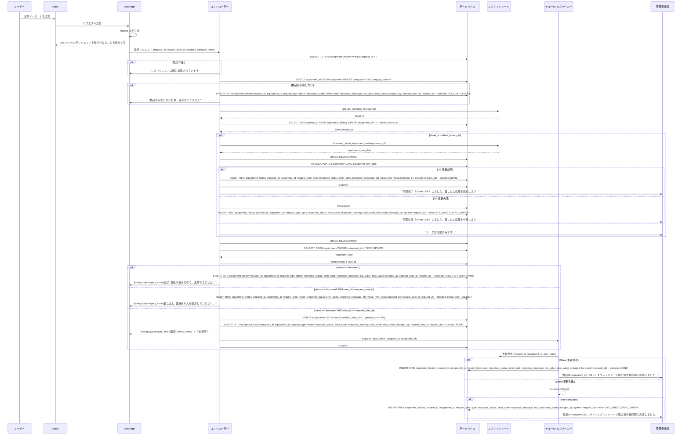

# 物品を返却する機能

- [物品を返却する機能](#物品を返却する機能)
  - [機能詳細](#機能詳細)
  - [シーケンス図](#シーケンス図)

## 機能詳細

Slack から返却メッセージを送信し，物品を返却する．

## シーケンス図

```mermaid
sequenceDiagram
    participant ユーザー
    participant Slack
    participant SlackApp as Slack App
    participant Controller as コントローラー
    participant DB as データベース
    participant Sheet as スプレッドシート
    participant Queue as キュー/ジョブワーカー
    participant Admin as 管理者通知

    %% 1. Slackでリクエスト送信
    ユーザー ->> Slack: 返却メッセージを送信
    Slack ->> SlackApp: リクエスト送信
    SlackApp ->> SlackApp: request_idを生成
    SlackApp -->> Slack: 200 OK (ACK)でリクエストを受け付けたことを知らせる

    %% 2. リクエスト受け取り
    SlackApp ->> Controller: 返却リクエスト (request_id, request_user_id, category, category_index)
    Controller ->> DB: SELECT 1 FROM equipment_history WHERE request_id = ?
    alt 既に存在
        Controller ->> SlackApp: "このリクエストは既に処理されています"
    end

    %% 3. 貸し出し対象の物品IDを取得
    Controller ->> DB: SELECT equipment_id FROM equipments WHERE category=? AND category_index=?
    alt 物品が存在しない
        Controller ->> DB: INSERT INTO equipment_history (request_id, equipment_id, request_type: return, response_status, error_code, response_massage, old_value, new_value,changed_by: request_user_id, request_at) -- rejected: RULE_NOT_FOUND
        Controller ->> SlackApp: "物品が存在しないため，返却ができません"
    end

    %% 4. 同期確認: スプレッドシートと DB の最新タイムスタンプを取得し，比較
    Controller ->> Sheet: get_last_updated_timestamp()
    Sheet -->> Controller: sheet_ts
    Controller ->> DB: SELECT MAX(request_at) FROM equipment_history WHERE equipment_id = ?  -- latest_history_ts
    DB -->> Controller: latest_history_ts

    alt sheet_ts > latest_history_ts
        %% sheet -> DB 同期
        Controller ->> Sheet: download_latest_equipment_row(equipment_id)
        Sheet -->> Controller: equipment_row_data
        Controller ->> DB: BEGIN TRANSACTION
        Controller ->> DB: MERGE/UPDATE equipments USING equipment_row_data
        alt DB 更新成功
            Controller ->> DB: INSERT INTO equipment_history (request_id, equipment_id, request_type: sync, response_status, error_code, response_massage, old_value, new_value,changed_by: system, request_at) -- success: NONE
            Controller ->> DB: COMMIT
            Controller ->> Admin: "同期完了（Sheet→DB）しました．貸し出し処理を続行します．"
        else DB 更新失敗
            Controller ->> DB: ROLLBACK
            Controller ->> DB: INSERT INTO equipment_history (request_id, equipment_id, request_type: sync, response_status, error_code, response_massage, old_value, new_value,changed_by: system, request_at) -- error: SYS_SHEET_SYNC_ERROR
            Controller ->> Admin: "同期失敗（Sheet→DB）しました．貸し出し処理を中断します．"
        end
    else
        %% 同期済み
        Controller ->> Admin: "データは同期済みです．"
    end

    %% 5. 返却処理を実行
    Controller ->> DB: BEGIN TRANSACTION
    Controller ->> DB: SELECT * FROM equipments WHERE equipment_id = ? FOR UPDATE
    DB -->> Controller: equipment_row
    Controller ->> DB: check status & user_id
    alt status != 'borrowed'
        Controller ->> DB: INSERT INTO equipment_history (request_id, equipment_id, request_type: return, response_status, error_code, response_massage, old_value, new_value,changed_by: request_user_id, request_at) -- rejected: RULE_NOT_BORROWED
        Controller ->> SlackApp: "{category}{category_index}返却: 現在未使用なので，返却できません．"
    else status == 'borrowed' AND user_id != request_user_id
        Controller ->> DB: INSERT INTO equipment_history (request_id, equipment_id, request_type: return, response_status, error_code, response_massage, old_value, new_value,changed_by: request_user_id, request_at) -- rejected: RULE_NOT_OWNER
        Controller ->> SlackApp: "{category}{category_index}貸し出し: 使用者本人が返却してください．"
    else status == 'borrowed' AND user_id == request_user_id
        Controller ->> DB: UPDATE equipments SET status='available', user_id=?, updated_at=NOW()
        Controller ->> DB: INSERT INTO equipment_history (request_id, equipment_id, request_type: return, response_status, error_code, response_massage, old_value, new_value,changed_by: request_user_id, request_at) -- success: NONE
        Controller ->> SlackApp: "{category}{category_index}返却: {slack_name} -> 【未使用】"
        %% スプレッドシートは非同期で更新
        Controller ->> Queue: enqueue "sync_sheet" (request_id, equipment_id)
    Controller ->> DB: COMMIT
    end

    %% 6. スプレッドシート同期
    Queue ->> Sheet: 更新要求 (request_id, equipment_id, new_state)
    alt Sheet 更新成功
        Queue ->> DB: INSERT INTO equipment_history (request_id, equipment_id, request_type: sync, response_status, error_code, response_massage, old_value, new_value, changed_by: system, request_at) -- success: NONE
        Queue ->> Admin: "物品ID{equipment_id}: DB <-> スプレッドシート間の操作後同期に成功しました．"
    else Sheet 更新失敗
        Queue -->> Queue: retry backoff (n回)
        alt retry exhausted
            Queue ->> DB: INSERT INTO equipment_history (request_id, equipment_id, request_type: sync, response_status, error_code, response_massage, old_value, new_value,changed_by: system, request_at) -- error: SYS_SHEET_SYNC_ERROR
            Queue ->> Admin: "物品ID{equipment_id}: DB <-> スプレッドシート間の操作後同期に失敗しました．"
        end
    end

```
