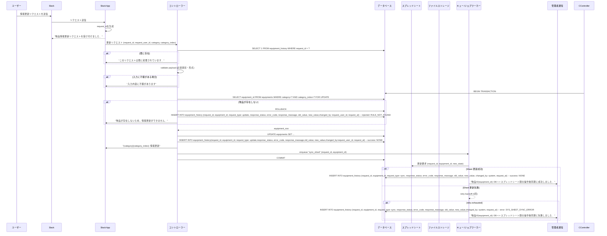

# 物品情報を更新する機能

- [物品情報を更新する機能](#物品情報を更新する機能)
  - [機能詳細](#機能詳細)
  - [シーケンス図](#シーケンス図)

## 機能詳細

Slack から情報更新メッセージを送信し，物品情報を更新する

## シーケンス図

```mermaid
sequenceDiagram
    participant ユーザー
    participant Slack
    participant SlackApp as Slack App
    participant Controller as コントローラー
    participant DB as データベース
    participant Sheet as スプレッドシート
    participant Storage as ファイルストレージ
    participant Queue as キュー/ジョブワーカー
    participant Admin as 管理者通知

    %% 1. Slackでリクエスト送信
    ユーザー ->> Slack: 情報更新リクエストを送信
    Slack ->> SlackApp: リクエスト送信
    SlackApp ->> SlackApp: request_idを生成
    SlackApp -->> Slack: "物品情報更新リクエストを受け付けました．"

    %% 2. リクエスト受け取り
    SlackApp ->> Controller: 更新リクエスト (request_id, request_user_id, category, category_index)
    Controller ->> DB: SELECT 1 FROM equipment_history WHERE request_id = ?
    alt 既に存在
        Controller ->> SlackApp: "このリクエストは既に処理されています．"
    end

    %% 3. 入力バリデーション
    Controller ->> Controller: validate payload (必須項目・形式)
    alt 入力に不備がある場合
        Controller ->> SlackApp: "入力内容に不備があります"
    end

    %% 4. 更新処理を実行
    CController ->> DB: BEGIN TRANSACTION
    Controller ->> DB: SELECT equipment_id FROM equipments WHERE category=? AND category_index=? FOR UPDATE
    alt 物品が存在しない
        Controller ->> DB: ROLLBACK
        Controller ->> DB: INSERT INTO equipment_history (request_id, equipment_id, request_type: update, response_status, error_code, response_massage, old_value, new_value,changed_by: request_user_id, request_at) -- rejected: RULE_NOT_FOUND
        Controller ->> SlackApp: "物品が存在しないため，情報更新ができません．"
    end
    DB -->> Controller: equipment_row
    Controller ->> DB: UPDATE equipments SET ...
    Controller ->> DB: INSERT INTO equipment_history(request_id, equipment_id, request_type: update,response_status, error_code, response_massage,old_value, new_value,changed_by:request_user_id, request_at) -- success: NONE
    Controller ->> SlackApp: "{category}{category_index}: 情報更新"
    %% スプレッドシートは非同期で更新
    Controller ->> Queue: enqueue "sync_sheet" (request_id, equipment_id)
    Controller ->> DB: COMMIT

    %% 5. スプレッドシート同期
    Queue ->> Sheet: 更新要求 (request_id, equipment_id, new_state)
    alt Sheet 更新成功
        Queue ->> DB: INSERT INTO equipment_history (request_id, equipment_id, request_type: sync, response_status, error_code, response_massage, old_value, new_value, changed_by: system, request_at) -- success: NONE
        Queue ->> Admin: "物品ID{equipment_id}: DB <-> スプレッドシート間の操作後同期に成功しました．"
    else Sheet 更新失敗
        Queue -->> Queue: retry backoff (n回)
        alt retry exhausted
            Queue ->> DB: INSERT INTO equipment_history (request_id, equipment_id, request_type: sync, response_status, error_code, response_massage, old_value, new_value,changed_by: system, request_at) -- error: SYS_SHEET_SYNC_ERROR
            Queue ->> Admin: "物品ID{equipment_id}: DB <-> スプレッドシート間の操作後同期に失敗しました．"
        end
    end

```
